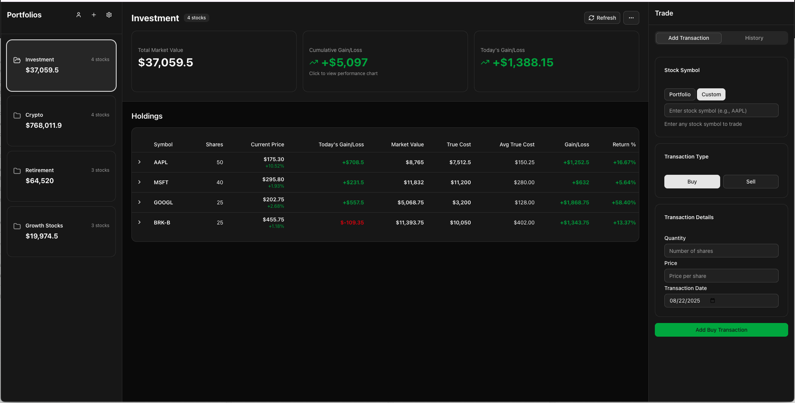

# Stock Tracker Web App

A web-based stock portfolio tracker built with Next.js, an alternative to TradingView's portfolio manager.

🚀 **Live Demo**: Check out the app in action at [https://littlefortune.ai](https://littlefortune.ai)



## Getting Started

### Prerequisites

- Node.js 18+ 
- npm or yarn
- A Google Cloud Platform account (for OAuth)
- A backend API server (see [Backend API Setup](#2-backend-api-setup))

### Installation

1. **Install dependencies**
   ```bash
   npm install
   # or
   yarn install
   ```

2. **Set up environment variables**
   ```bash
   cp .env.example .env.local
   ```

   Edit `.env.local` with your actual values:
   ```bash
   # Google OAuth Configuration
   NEXT_PUBLIC_GOOGLE_CLIENT_ID=your-google-client-id-here
   
   # API Configuration
   NEXT_PUBLIC_API_BASE_URL=http://localhost:8080
   NEXT_PUBLIC_STOCK_API_KEY=your-stock-api-key-here
   ```

### Environment Variables Setup

#### 1. Google OAuth Setup

1. Go to [Google Cloud Console](https://console.cloud.google.com/)
2. Create a new project or select existing one
3. Enable the Google+ API
4. Go to "Credentials" → "Create Credentials" → "OAuth 2.0 Client IDs"
5. Set application type to "Web application"
6. Add authorized origins:
   - `http://localhost:3000` (for development)
   - Your production domain (for production)
7. Copy the Client ID to `NEXT_PUBLIC_GOOGLE_CLIENT_ID`

#### 2. Backend API Setup

This frontend requires a backend API server running on port 8080, with APIs to handle authentication, data storage, and stock price fetching. 
**Ready-to-use Backend**: A compatible backend server is available at [https://github.com/north212wangbo/stock-portfolio-tracker-server](https://github.com/north212wangbo/stock-portfolio-tracker-server)

#### 3. Stock API Key

You'll need an API key for stock price data. The app is configured to work with stock APIs that require an API key parameter. Set server side env API_SECRET_KEY to be the same as NEXT_PUBLIC_STOCK_API_KEY

### Running the Application

1. **Start the development server**
   ```bash
   npm run dev
   # or
   yarn dev
   ```

2. **Open your browser**
   Navigate to [http://localhost:3000](http://localhost:3000)

3. **Make sure your backend API is running**
   The backend should be running on [http://localhost:8080](http://localhost:8080)

## License

This project is licensed under the MIT License - see the [LICENSE](LICENSE) file for details.

## Support

If you encounter any issues or have questions:

1. Check the [GitHub Issues](https://github.com/north212wangbo/stock-tracker-web/issues)
2. Create a new issue if your problem isn't already documented
3. Provide detailed information about your setup and the issue you're experiencing